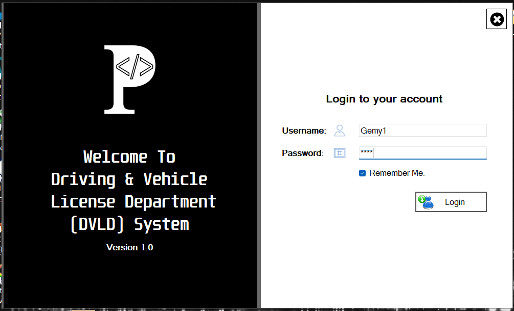
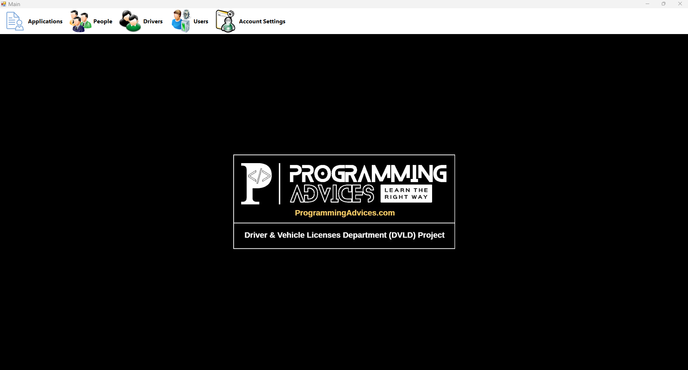
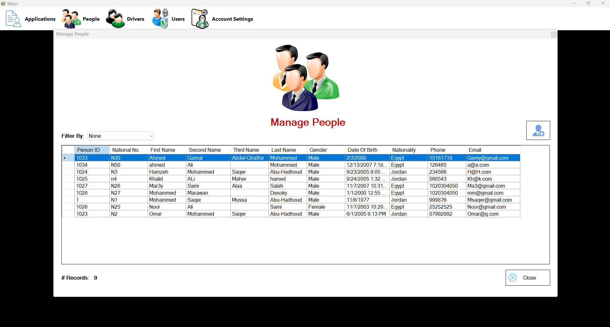
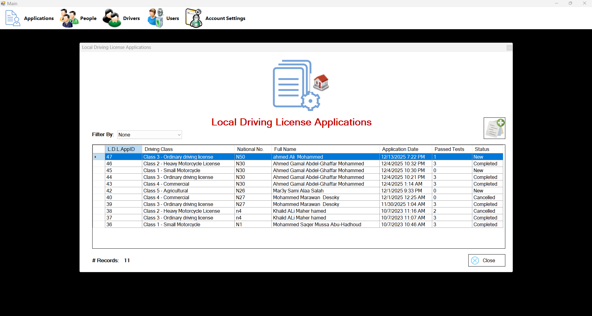
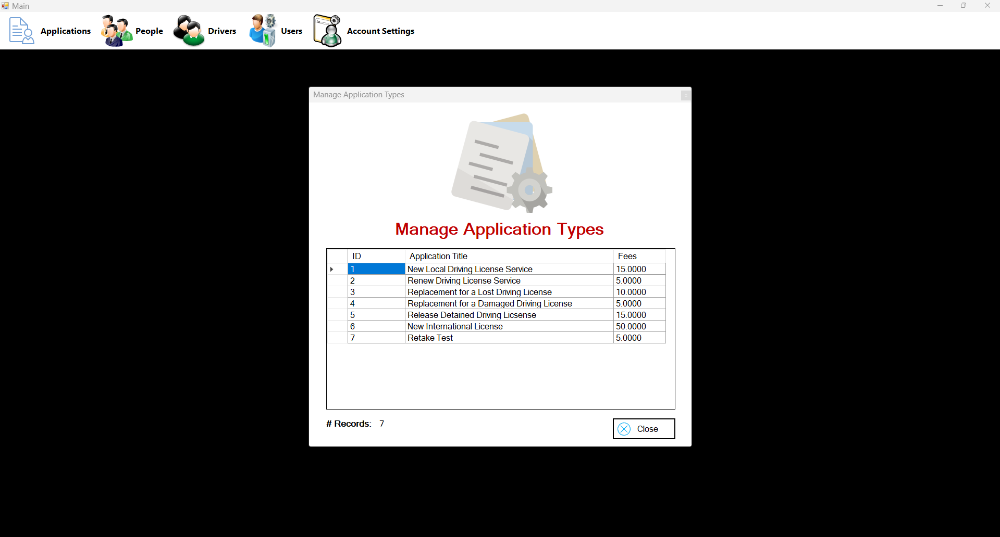

# DVLD Management System

DVLD Management System is a Windows Forms desktop application for managing driving license services through a structured, rule-based workflow.

The project applies desktop application development concepts using C#, SQL Server, and ADO.NET within a 3-layer architecture. It covers the full process of handling people, applications, tests, licenses, and related services in a database-driven system.

## Overview

This system simulates the core operations of a driving license department. It manages applicant records, license applications, test appointments, license issuance, renewal, detention, release, and international licenses through a business workflow with validations and process rules.

## Tech Stack

- C#
- Windows Forms
- SQL Server
- ADO.NET
- SQL Queries

## Architecture

The project follows a 3-layer architecture:

- Presentation Layer
- Business Layer
- Data Access Layer

This structure helps separate the user interface, business logic, and database operations for better organization and maintainability.

## Features

### Core Modules
- Login system
- People management
- Users management
- Drivers management
- Local driving license applications
- Test appointments
- Application types management
- Test types management
- Detained licenses management

### License Services
- First-time license issuance
- License renewal
- Replacement for lost licenses
- Replacement for damaged licenses
- License detention
- Release detained licenses
- International license issuance

## Business Workflow

The system follows a structured workflow:

1. A person is registered in the system.
2. The person submits a driving license application.
3. The applicant completes the required tests in order.
4. After passing all required steps, the license can be issued.
5. Additional services such as renewal, replacement, detention, release, and international licensing can then be managed.

## Test Process

The system includes three required tests:

- Vision Test
- Written Test
- Practical Driving Test

## Business Rules

The project applies several business validations and restrictions, including:

- Tests must be completed in sequence
- A test cannot be scheduled before passing the previous one
- Failed tests require a retake application with additional fees
- Passed tests cannot be repeated unnecessarily
- Minimum age depends on the selected license class
- Some actions depend on the current application status
- Some services depend on the current license status
- International licenses can only be issued under specific conditions

## Search and Filtering

The application supports search and filtering in listing screens using `DataGridView`.

Examples include searching by:
- ID
- National Number
- Name

Some inputs are also validated depending on the selected search type.

## Authentication and Security

The project includes a login system for system users.

Password handling was improved from plain text storage to a more secure approach using:
- PasswordHash
- PasswordSalt

with a randomly generated salt value.

## Reusable UI Components

The project includes reusable UI elements such as:
- UserControls reused across multiple screens
- Context menus for quick access to related actions
- Shared interface components for presenting license-related information

## Data Source

All core data is stored in SQL Server.

The application relies on database-driven operations through ADO.NET and SQL queries.

## Screenshots

Here are some screenshots showing the main screens and workflows of the application.

<table>
  <tr>
    <td align="center">
      
       
      <b>Login Screen</b>
    </td>
    <td align="center">
      
       
      <b>Main Menu</b>
    </td>
  </tr>
  <tr>
    <td align="center">
      
       
      <b>People List</b>
    </td>
    <td align="center">
      
       
      <b>Local License Application</b>
    </td>
  </tr>
  <tr>
    <td align="center">
      
       
      <b>Application Types</b>
    </td>
    <td align="center">
      
       
      <b>Detained Licenses</b>
    </td>
  </tr>
</table>

## Current Limitations

- No role-based authorization system
- No dashboard or advanced reporting module
- No printing support
- Some UI parts can still be improved and refined

## Future Improvements

Possible future enhancements include:

- Add role-based permissions
- Add reports and statistics
- Add printing support
- Improve UI design and usability
- Refactor some modules for better maintainability

## Project Purpose

This project was built as a practical training project to apply real-world concepts in:

- Desktop application development
- Layered architecture
- Business workflow implementation
- Database-driven systems using ADO.NET and SQL Server